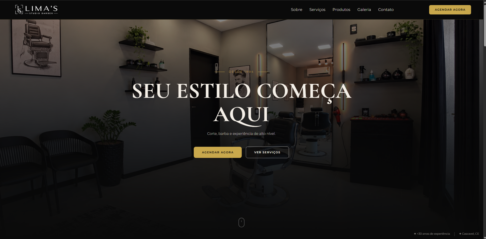

<p align="center">
  
</p>

<h1 align="center">Lima's Studio Barber | Plataforma Web para Barbearia</h1>

<p align="center">
  Site institucional com agendamento online, painel administrativo e integração com Mercado Pago.
  <br/>
  Desenvolvido para a barbearia Lima's Studio Barber, em Cascavel, CE.
</p>

---

## 🖥️ Landing Page



---

## ✂️ Serviços


---

## 📱 Responsividade

- Todas as seções adaptadas para o mobile sem alterar o layout do desktop
- Navbar que vira uma bolinha em volta do menu ao rolar a página
- Menu lateral com links das seções, Wi-Fi da barbearia e atalhos para Instagram e WhatsApp
- Galeria e blog com carrossel de card único e setas em círculo dourado
- Rodapé em grade 2x2 (logo e endereço, horário e contato)

---

## ⚙️ Funcionalidades

### 🗓️ Agendamento Online
- Agendamento sem necessidade de login
- Seleção de até 3 serviços por agendamento
- Escolha de data e horário com disponibilidade em tempo real
- Pagamento de sinal (R$ 5,00) ou valor total via **Pix** integrado ao Mercado Pago
- Horário reservado por 10 minutos aguardando o pagamento, e liberado automaticamente se não for pago
- Campo de cupom de desconto no agendamento

### 📋 Painel Administrativo
- **Dashboard** com métricas em tempo real: confirmados, pendentes, cancelados e receita
- **Agenda** com visualização diária, agendamento avulso (walk-in), controle de status e horário especial por dia
- **Clientes** com histórico de atendimentos, busca por nome e atalho para WhatsApp
- **Serviços** com edição de preço, duração e promoções
- **Produtos** com gestão de estoque e registro de vendas
- **Relatórios** com faturamento por período, ticket médio e taxa de no-show
- **Aniversariantes** do dia para ações de marketing
- **Avaliações** dos clientes com média geral e filtro por nota
- **Cupons** com cupons manuais e automáticos, validade e limite de usos
- Acesso restrito ao administrador

### ⭐ Sistema de Avaliações
- Avaliação com estrelas (1-5) e comentário
- Geração automática de cupom de desconto após avaliar no Google (`AVA-XXXXX`)
- Notas 1 e 2 não entram na média, mas aparecem no painel para o administrador
- Botão de WhatsApp para solicitar avaliações diretamente aos clientes

### 🎟️ Sistema de Cupons
- Cupons automáticos gerados após avaliação no Google
- Cupons manuais com código personalizado
- Controle de validade, limite de usos e ativação/desativação
- Desconto aplicável no sinal ou no valor total

### ⏰ Gerenciamento de Horários
- Segunda a sábado: 08:00 às 18:00, com pausa para almoço das 12:00 às 14:00
- Domingo: fechado
- Horário especial ou fechamento por dia específico direto pela agenda do painel

### 📶 QR Code Wi-Fi
- QR Code no menu mobile com as credenciais da rede Wi-Fi da barbearia
- Cliente conecta sem precisar digitar senha

---

## 🛠️ Stack Técnica

| Tecnologia | Uso |
|-----------|-----|
| **Figma** | Prototipação do layout |
| **Laravel 13** | Backend e rotas |
| **Tailwind CSS 4** | Estilização |
| **Alpine.js** | Interatividade no frontend |
| **MySQL** | Banco de dados |
| **Mercado Pago API** | Geração de Pix e webhooks |
| **Vite** | Build dos assets |

---

## 🚀 Instalação Local

```bash
# Clone o repositório
git clone https://github.com/MatheusdePaulo/barbearia-LimasStudioBarber.git
cd barbearia-LimasStudioBarber

# Instale as dependências
composer install
npm install

# Configure o ambiente (banco MySQL e credenciais do Mercado Pago no .env)
cp .env.example .env
php artisan key:generate

# Rode as migrations
php artisan migrate

# Crie o usuário administrador
php artisan tinker --execute "App\Models\User::forceCreate(['name'=>'Admin','email'=>'admin@exemplo.com','password'=>bcrypt('senha'),'is_admin'=>true]);"

# Compile os assets e suba o servidor
npm run build
php artisan serve
```

O painel fica em `/admin` (login em `/login`) e o agendamento em `/agendar`.

---

## 📄 Licença

MIT License © 2026 [Matheus de Paulo](https://matheusdepaulo.com)
